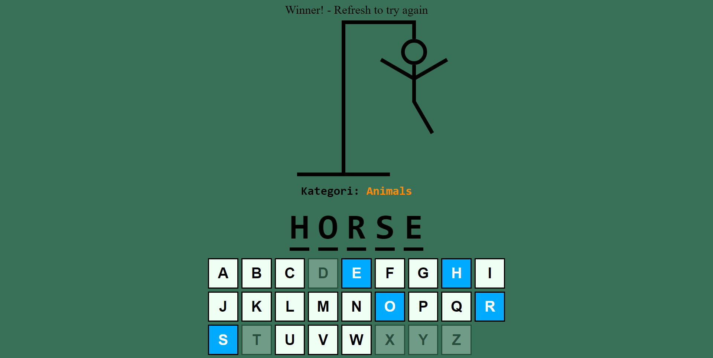

# Adam Asmaca Oyunu

Bu proje, React ve TypeScript kullanarak öğrendiklerimi pekiştirmek amacıyla geliştirilmiş basit bir Adam Asmaca oyununu içermektedir.



# Nasıl Kullanılır

1. Proje dosyalarını bilgisayarınıza klonlayın veya indirin.
```bash
 git clone https://github.com/malikemiroglu/AdamAsmaca.git
```

2. Proje klasörüne gidin.
```bash
cd AdamAsmaca
```


3. Gerekli bağımlılıkları yükleyin.
```bash
npm install
```

4. Uygulamayı başlatın.
```bash
npm run dev
```

5. Tarayıcınızda aşağıdaki adresi ziyaret edin ve XOX oyununu oynamaya başlayın!
```bash
http://localhost:3000
```  

# Nasıl Oynanır
- Oyunu başlatmak için tarayıcınızda http://localhost:3000 adresine gidin.
- Bir kelime kategorisi ve kelime seçilecek ve oyun başlayacaktır.
- Her harfi tahmin etmeye çalışın. Her yanlış tahmin, asma figürünü çizmeye başlar.
- 6 yanlış tahmin yaparsanız kaybedersiniz. Tüm harfleri doğru tahmin ederseniz kazanırsınız.
- Oyun sona erdiğinde sayfa yenilemeyi unutmayın!
